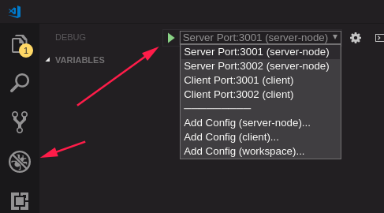
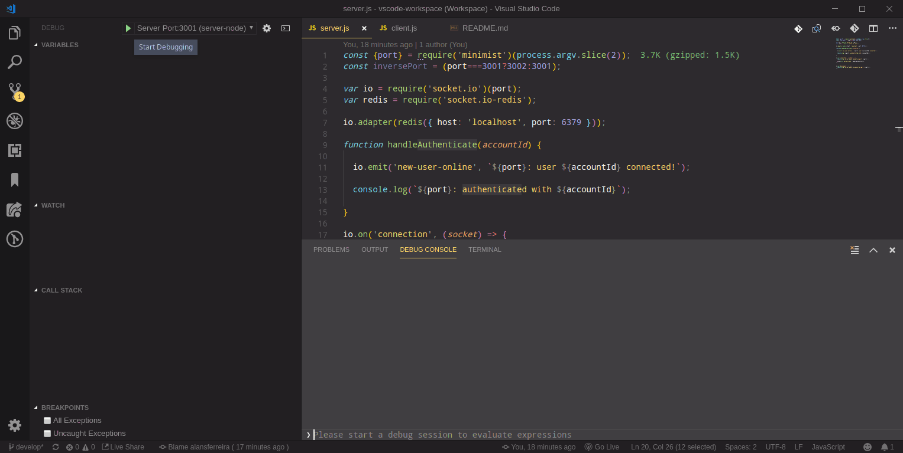

# socket.io-cluster-redis
This is an sample to use socket.io server nodes shared with redis

The purpose of this example is to implement a clustered socket implementation.

In this example we have 2 socket.io servers listening to their respective ports 3001 and 3002, simulating different nodes in a cluster, but having to share the connected user sessions.

In addition to 2 clients connecting each other to a different port 3001 and 3002, simulating a load balancer where they would be dispatched to different sockets.

Considering that an active customer has to be notified when new users enter.


## Getting started

### Install and start an Redis server

```sh
docker pull redis

docker run -p 6379:6379 --name socket-cluster-redis -d redis
```

### Install dependencies

```sh

cd ./server-node && npm i

cd ../client && npm i

```


### Running from VSCode





